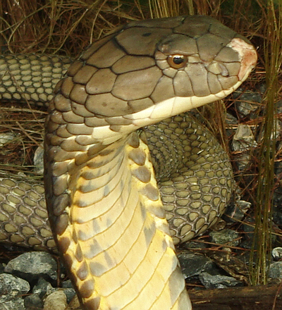
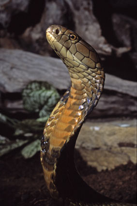

# SmartSerpent



SmartSerpent is a FastAPI-based snake identification web app with a clean multi-page frontend built using plain HTML, CSS, and JavaScript. It combines a deep-learning baseline classifier with a cosine-similarity verification layer, then extends the result with structured species details.

## Highlights

- `MobileNetV2` baseline classifier with `79.3%+` accuracy
- Cosine-similarity verification layer with `87%` matching performance
- Bicubic upscaling applied to every uploaded image before prediction
- Multi-page light-theme frontend for upload, prediction, and species detail review
- Gemini-ready detail generation with a safe fallback mode

## Performance Snapshot

| Component | Method | Reported Result |
| --- | --- | --- |
| Baseline classifier | `MobileNetV2` | `79.3%+` accuracy |
| Verification layer | Cosine similarity on embeddings | `87%` verification performance |
| Upload preprocessing | Bicubic upscaling | Applied to every uploaded image |

## Preview



## How It Works

SmartSerpent follows a two-stage recognition pipeline:

1. The user uploads a snake image from the frontend.
2. The backend saves the image and applies `bicubic upscaling` to improve visible detail.
3. The upscaled image is passed through the `MobileNetV2` baseline classifier.
4. A verification layer compares embeddings using `cosine similarity`.
5. The app returns the predicted `snake_name` and `confidence`.
6. The user can request a structured species summary on the details page.

## Model Stack

### 1. Baseline Classifier

- Architecture: `MobileNetV2`
- Role: primary species classification
- Reported accuracy: `79.3%+`

### 2. Verification Layer

- Method: embedding comparison with cosine similarity
- Role: secondary validation signal for prediction quality
- Reported verification performance: `87%`

### 3. Detail Generation

- Provider: Gemini-compatible structured output layer
- Role: species overview, habitat, venom profile, first aid, and safety guidance
- Fallback: structured offline-style response when Gemini is unavailable

## Product Flow

### Landing Page

- Introduces the system
- Guides the user into the prediction workflow

### Get Prediction

- Upload a snake image
- Preview the selected image on the left side
- Run prediction and confidence scoring

### Upload Result

- Returns the predicted `snake_name` and `confidence`

### Get More Details

- Sends the predicted snake name into the structured detail layer
- Returns canonical name, scientific name, habitat, venom information, first aid, and safety notes

## Tech Stack

- Backend: `FastAPI`
- Frontend: `HTML`, `CSS`, `JavaScript`
- ML Framework: `TensorFlow / Keras`
- Vision Model: `MobileNetV2`
- Similarity Search: `FAISS`
- LLM Layer: `Gemini`

## Project Structure

```text
SmartSerpent/
├── main.py
├── frontend/
│   ├── templates/
│   └── static/
├── src/
│   ├── api/
│   ├── config/
│   ├── llm/
│   ├── models/
│   ├── retrive/
│   └── utils/
├── dataset/
└── pyproject.toml
```

## Key Backend Behavior

- Every uploaded image is processed through `bicubic upscaling`
- The baseline classifier produces the first prediction
- The verification layer checks similarity against stored embeddings
- The API returns a clean JSON response for frontend rendering

## API Endpoints

### Page Routes

- `/` - landing page
- `/predict` - upload and prediction page
- `/details` - structured details page

### API Routes

- `GET /api/health` - health check
- `POST /api/predict` - upload image and get prediction
- `POST /api/details` - fetch structured species details

## Local Setup

### 1. Install dependencies

```bash
uv sync
```

If you are using the existing virtual environment:

```bash
source .venv/bin/activate
uv sync
```

### 2. Configure environment

Create or update `.env`:

```env
GOOGLE_API_KEY=your_key_here
SMARTSERPENT_ENABLE_GEMINI=true
```

If `SMARTSERPENT_ENABLE_GEMINI` is omitted or set to `false`, the app will use the structured fallback response for the details page.

### 3. Run the app

```bash
.venv/bin/python main.py
```

Then open:

```text
http://127.0.0.1:8000
```

## Example Output

### Prediction Response

```json
{
  "snake_name": "King Cobra",
  "confidence": 68.86,
  "baseline_prediction": {
    "snake_name": "King Cobra",
    "confidence": 68.86,
    "class_index": 12
  },
  "similarity_prediction": {
    "snake_name": "King Cobra",
    "similarity": 0.91,
    "index": 244
  }
}
```

### Details Response

```json
{
  "snake_name": "King Cobra",
  "confidence": 68.86,
  "details": {
    "canonical_name": "King Cobra",
    "scientific_name": "Ophiophagus hannah",
    "venomous": "yes"
  }
}
```

## Notes

- This project is useful for demos, educational tools, and wildlife-tech prototypes.
- Species details should not replace expert field identification or emergency medical advice.
- Prediction quality depends heavily on image clarity, angle, lighting, and visible body pattern.

## Roadmap

- Add drag-and-drop upload improvements
- Add prediction history
- Add frontend screenshots to the README
- Add top-k prediction display
- Add model performance dashboard

## Author
Hemanth 

